## The Data


```r
x <- read.csv("C:\\Users\\Owner\\Dropbox\\FRDA\\U_20190310_Abdul\\Git01\\survey_data_format.csv",header=TRUE)
```

## Descriptive Analyses


```
## 'data.frame':	109 obs. of  87 variables:
##  $ Api_region            : Factor w/ 7 levels "Abha","Albaha",..: 4 4 4 4 4 4 4 4 4 4 ...
##  $ Api_no.               : int  1 1 1 1 1 1 1 1 1 1 ...
##  $ Api_15km              : int  1 1 1 1 1 1 1 1 1 1 ...
##  $ Api_env               : int  1 1 1 1 1 1 1 1 1 1 ...
##  $ Other_env             : logi  NA NA NA NA NA NA ...
##  $ Api_loc_type          : int  2 2 2 1 1 2 2 2 1 2 ...
##  $ Other_loc_type        : logi  NA NA NA NA NA NA ...
##  $ Cols__Spr17           : int  350 180 400 560 450 400 380 450 155 200 ...
##  $ Cols_Sum17            : int  300 160 300 490 385 350 360 530 150 180 ...
##  $ Cols_Aut17            : int  320 150 350 440 370 350 360 400 149 170 ...
##  $ Cols_Win1718          : int  310 150 360 430 380 NA 300 390 140 160 ...
##  $ Cols_Spr18            : int  300 180 340 600 390 600 320 470 135 160 ...
##  $ Lost_cols1718         : int  1 1 1 1 1 1 1 2 1 1 ...
##  $ Lost_Spr17            : int  30 20 25 30 50 45 40 NA 10 10 ...
##  $ Lost_Sum17            : int  50 40 45 70 85 65 60 NA 30 20 ...
##  $ Lost_Aut17            : int  35 30 30 50 55 40 20 NA 20 10 ...
##  $ Lost_Win1718          : int  40 10 30 40 55 45 30 NA 10 20 ...
##  $ Lost_Spr18            : int  40 15 30 55 50 50 20 NA 10 15 ...
##  $ Cause_V               : int  1 1 NA NA NA 1 1 NA 1 NA ...
##  $ Cause_D               : int  1 1 NA NA NA NA 1 NA 1 NA ...
##  $ Cause_QP              : int  NA 1 NA NA NA NA NA NA NA NA ...
##  $ Cause_St              : int  NA NA NA 1 NA NA NA NA NA 1 ...
##  $ Cause_ExW             : int  NA NA NA 1 1 1 1 NA NA 1 ...
##  $ Cause_Oth             : logi  NA NA NA NA NA NA ...
##  $ Other_loss_cause      : logi  NA NA NA NA NA NA ...
##  $ Migrate               : int  1 2 2 1 1 1 1 2 2 1 ...
##  $ Migrate_when          : Factor w/ 5 levels ""," May","Apr",..: 3 1 1 2 2 3 3 1 1 3 ...
##  $ Migrate_where         : logi  NA NA NA NA NA NA ...
##  $ Honey_kg              : int  400 390 450 560 360 580 800 660 350 200 ...
##  $ Broodcomb_rep         : int  2 1 1 2 2 1 2 1 1 3 ...
##  $ Varroa_not_det        : int  1 3 3 3 1 3 2 1 2 2 ...
##  $ Varroa_monitor        : int  1 3 3 1 1 3 1 2 1 3 ...
##  $ Varroa_treated        : int  1 1 1 2 2 1 1 2 1 1 ...
##  $ V_monitor_start_Apr17 : logi  NA NA NA NA NA NA ...
##  $ V_monitor_start_May17 : logi  NA NA NA NA NA NA ...
##  $ V_monitor_start_Jun17 : logi  NA NA NA NA NA NA ...
##  $ V_monitor_start_Jul17 : logi  NA NA NA NA NA NA ...
##  $ V_monitor_start_Aug17 : int  NA NA NA NA NA NA NA NA NA NA ...
##  $ V_monitor_start_Sep.17: int  NA NA NA NA NA NA NA NA NA NA ...
##  $ V_monitor_start_Oct17 : int  NA NA 1 NA NA NA 1 NA NA NA ...
##  $ V_monitor_start_Nov17 : int  1 1 1 NA NA NA 1 NA 1 1 ...
##  $ V_monitor_start_Dec17 : int  1 NA NA NA NA NA NA NA 1 1 ...
##  $ V_monitor_start_Jan18 : int  NA NA NA NA NA NA NA NA NA NA ...
##  $ V_monitor_start_Feb18 : logi  NA NA NA NA NA NA ...
##  $ V_monitor_start_Mar18 : logi  NA NA NA NA NA NA ...
##  $ V_monitor_start_Apr18 : logi  NA NA NA NA NA NA ...
##  $ Tau.fl_Apr17          : logi  NA NA NA NA NA NA ...
##  $ Tau.fl_May17          : logi  NA NA NA NA NA NA ...
##  $ Tau.fl_Jun17          : int  NA NA NA NA NA NA NA NA NA NA ...
##  $ Tau.fl_Jul17          : int  1 NA NA NA NA NA NA NA NA NA ...
##  $ Tau.fl_Aug17          : int  1 1 1 NA NA 1 NA NA NA 1 ...
##  $ Tau.fl_Sep.17         : int  NA 1 1 NA NA 1 NA NA NA 1 ...
##  $ Tau.fl__Oct17         : int  NA NA NA NA NA NA NA NA NA NA ...
##  $ Tau.fl__Nov17         : logi  NA NA NA NA NA NA ...
##  $ Tau.fl_Dec17          : logi  NA NA NA NA NA NA ...
##  $ Tau.fl__Jan18         : logi  NA NA NA NA NA NA ...
##  $ Tau.fl__Feb18         : logi  NA NA NA NA NA NA ...
##  $ Tau.fl__Mar18         : logi  NA NA NA NA NA NA ...
##  $ Tau.fl_Apr18          : logi  NA NA NA NA NA NA ...
##  $ Def_wings             : int  1 2 2 1 2 2 2 1 2 3 ...
##  $ Screened_bottom_brd   : int  1 1 1 NA 2 1 1 1 1 1 ...
##  $ Ins_hives             : int  NA NA NA NA 2 2 2 2 2 2 ...
##  $ Plastic_hives         : int  NA NA NA NA 2 2 2 2 2 2 ...
##  $ Cert_organic_beek     : int  NA NA NA NA 1 2 2 2 2 2 ...
##  $ Varroa_tol_stock      : int  NA NA NA 1 1 2 2 1 2 1 ...
##  $ Small_brood_cell_size : int  NA NA NA NA 2 2 2 2 2 2 ...
##  $ Nat_comb              : int  NA NA NA 1 2 2 2 2 2 2 ...
##  $ Purchase_wax          : int  NA NA NA NA 1 1 1 1 1 1 ...
##  $ Pests                 : int  1 1 1 1 1 1 1 3 3 3 ...
##  $ Pests_name1           : Factor w/ 6 levels "","bee wolf",..: 2 3 4 3 6 4 2 1 1 1 ...
##  $ Pests_name2           : logi  NA NA NA NA NA NA ...
##  $ Pests_name3           : logi  NA NA NA NA NA NA ...
##  $ Protect_weather       : int  1 1 1 1 1 1 1 1 2 1 ...
##  $ Protect_weather1      : Factor w/ 3 levels "","shaded","Shaded": 3 3 3 3 2 3 3 3 1 3 ...
##  $ Protect_weather2      : logi  NA NA NA NA NA NA ...
##  $ Protect_weather3      : logi  NA NA NA NA NA NA ...
##  $ Bee_race              : int  2 2 2 1 1 2 2 1 1 2 ...
##  $ Other_bee_race        : logi  NA NA NA NA NA NA ...
##  $ Replace_queens        : int  1 2 1 1 1 2 1 2 2 2 ...
##  $ Rep_queen_loss        : int  NA NA NA NA 1 NA NA NA NA NA ...
##  $ Rep_queen_yearly      : int  1 NA NA NA NA NA NA NA NA NA ...
##  $ Rep_queen_eggs        : int  NA NA 1 1 NA NA 1 NA NA NA ...
##  $ Rep_queen_other       : logi  NA NA NA NA NA NA ...
##  $ Other_reason_q_rep    : logi  NA NA NA NA NA NA ...
##  $ Training_need         : int  2 2 2 2 2 2 2 2 2 2 ...
##  $ Training_need_describe: logi  NA NA NA NA NA NA ...
##  $ Concerns              : int  2 2 2 2 2 2 2 2 2 2 ...
```
### Education Levels

```r
factorVariableHistogram(x$Education,c("Primary School","Middle School","Secondary School","University","Self-Taught"),0.75,1.33,0.04,"Education Levels")
```

<!-- -->

```
## [1] "Number of Non-Missing Data Items"
## [1] 109
## [1] "Histogram Categories and Frequencies"
```

```
## x
##  1  2  3  4  5 
##  2  8 43 55  1
```
### Type of Beekeeper

```r
factorVariableHistogram(x$Beek_type,c("Hobby","Semi-Professional","Professional","Other"),0.75,1.33,0.04,"Type of Beekeper")
```

<!-- -->

```
## [1] "Number of Non-Missing Data Items"
## [1] 109
## [1] "Histogram Categories and Frequencies"
```

```
## x
##  1  2  3  4 
## 48 37 23  1
```
### Beekeeper Experience

```r
quantitativeVariableHistogram(x$Beek_years,"Years",0.75,1.33,0.04,"Beekeeper Experience")
```

<!-- -->

```
## [1] "Number of Non-Missing Data Items"
## [1] 109
## [1] "Mean"
## [1] 20.75229
## [1] "Quartiles"
##   0%  25%  50%  75% 100% 
##    2   14   20   27   45
```
### Beekeeping Purpose

```r
factorVariableHistogram(x$Beek_purpose,c("To Produce Honey","Breed and Sell Bees","Both of the Above"),0.75,1.33,0.04,"Beekeeping Purpose")
```

<!-- -->

```
## [1] "Number of Non-Missing Data Items"
## [1] 109
## [1] "Histogram Categories and Frequencies"
```

```
## x
##  1  2  3 
## 54  1 54
```
### Apiary Distance

```r
factorVariableHistogram(x$Api_15km,c("Yes","No"),0.75,1.33,0.04,"Distance Between Apiaries within 15km")
```

<!-- -->

```
## [1] "Number of Non-Missing Data Items"
## [1] 109
## [1] "Histogram Categories and Frequencies"
```

```
## x
##   1   2 
## 108   1
```
### Main Apiary Environment

```r
factorVariableHistogram(x$Api_env,c("Forest/Woodland","Cultivated Field","Orchard"),0.75,1.33,0.04,"Main Apiary Environment")
```

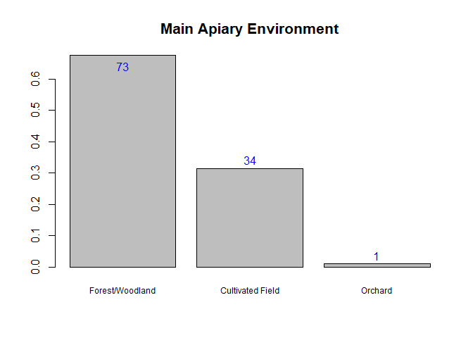<!-- -->

```
## [1] "Number of Non-Missing Data Items"
## [1] 109
## [1] "Histogram Categories and Frequencies"
```

```
## x
##  1  2  3 
## 73 34  1
```
### Immediate Apiary Environment

```r
factorVariableHistogram(x$Api_loc_type,c("Sunny","Shaded","Sheltered/Closed Place"),0.75,1.33,0.04,"Immediate Apiary Environment")
```

<!-- -->

```
## [1] "Number of Non-Missing Data Items"
## [1] 109
## [1] "Histogram Categories and Frequencies"
```

```
## x
##  1  2  3 
## 38 69  1
```
### Number of Colonies - Spring 2017

```r
quantitativeVariableHistogram(x$Cols__Spr17,"Number of Colonies",0.75,1.33,0.04,"Number of Colonies - Spring 2017")
```

<!-- -->

```
## [1] "Number of Non-Missing Data Items"
## [1] 109
## [1] "Mean"
## [1] 575.4587
## [1] "Quartiles"
##   0%  25%  50%  75% 100% 
##  155  360  540  710 1600
```
### Number of Colonies - Summer 2017

```r
quantitativeVariableHistogram(x$Cols_Sum17,"Number of Colonies",0.75,1.33,0.04,"Number of Colonies - Summer 2017")
```

<!-- -->

```
## [1] "Number of Non-Missing Data Items"
## [1] 109
## [1] "Mean"
## [1] 569.9541
## [1] "Quartiles"
##   0%  25%  50%  75% 100% 
##  150  350  500  750 1500
```
### Number of Colonies - Autumn 2017

```r
quantitativeVariableHistogram(x$Cols_Aut17,"Number of Colonies",0.75,1.33,0.04,"Number of Colonies - Autumn 2017")
```

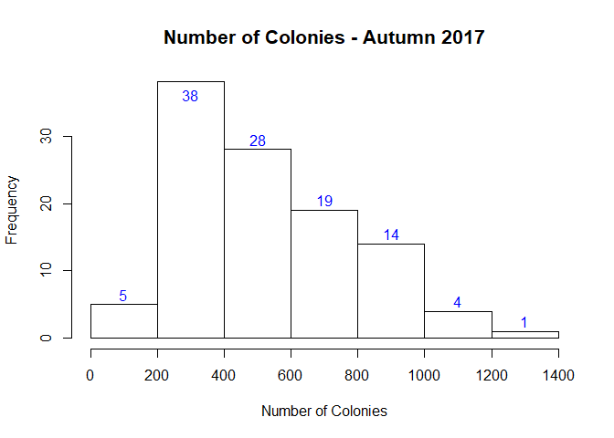<!-- -->

```
## [1] "Number of Non-Missing Data Items"
## [1] 109
## [1] "Mean"
## [1] 558.9817
## [1] "Quartiles"
##   0%  25%  50%  75% 100% 
##  149  350  500  700 1300
```
### Number of Colonies - Winter 2017-18

```r
quantitativeVariableHistogram(x$Cols_Win1718,"Number of Colonies",0.75,1.33,0.04,"Number of Colonies - Winter 2017-18")
```

<!-- -->

```
## [1] "Number of Non-Missing Data Items"
## [1] 108
## [1] "Mean"
## [1] 556.9444
## [1] "Quartiles"
##   0%  25%  50%  75% 100% 
##  140  380  500  700 1300
```
### Number of Colonies - Spring 2018

```r
quantitativeVariableHistogram(x$Cols_Spr18,"Number of Colonies",0.75,1.33,0.04,"Number of Colonies - Spring 2018")
```

<!-- -->

```
## [1] "Number of Non-Missing Data Items"
## [1] 109
## [1] "Mean"
## [1] 579.4037
## [1] "Quartiles"
##   0%  25%  50%  75% 100% 
##  135  400  540  720 1700
```
### Have you observed any losses of production colonies during the period from 2017 to 2018?

```r
factorVariableHistogram(x$Lost_cols1718,c("Yes","No"),0.75,1.33,0.04,"Have you observed any losses of production colonies\nduring the period from 2017 to 2018?")
```

<!-- -->

```
## [1] "Number of Non-Missing Data Items"
## [1] 109
## [1] "Histogram Categories and Frequencies"
```

```
## x
##  1  2 
## 91 18
```
### Number of Losses - Spring 2017

```r
quantitativeVariableHistogram(x$Lost_Spr17,"Number of Colonies",0.75,1.33,0.04,"Number of Colonies Lost - Spring 2017")
```

<!-- -->

```
## [1] "Number of Non-Missing Data Items"
## [1] 91
## [1] "Mean"
## [1] 53.18681
## [1] "Quartiles"
##   0%  25%  50%  75% 100% 
##    0   30   50   70  150
```
### Number of Losses - Summer 2017

```r
quantitativeVariableHistogram(x$Lost_Sum17,"Number of Colonies",0.75,1.33,0.04,"Number of Colonies Lost - Summer 2017")
```

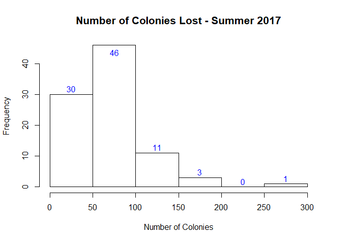<!-- -->

```
## [1] "Number of Non-Missing Data Items"
## [1] 91
## [1] "Mean"
## [1] 78.02198
## [1] "Quartiles"
##   0%  25%  50%  75% 100% 
##   20   50   70  100  300
```
### Number of Losses - Autumn 2017

```r
quantitativeVariableHistogram(x$Lost_Aut17,"Number of Colonies",0.75,1.33,0.04,"Number of Colonies Lost - Autumn 2017")
```

<!-- -->

```
## [1] "Number of Non-Missing Data Items"
## [1] 91
## [1] "Mean"
## [1] 55.35165
## [1] "Quartiles"
##   0%  25%  50%  75% 100% 
##   10   30   50   70  300
```
### Number of Losses - Winter 2017-18

```r
quantitativeVariableHistogram(x$Lost_Win1718,"Number of Colonies",0.75,1.33,0.04,"Number of Colonies Lost - Winter 2017-18")
```

<!-- -->

```
## [1] "Number of Non-Missing Data Items"
## [1] 91
## [1] "Mean"
## [1] 50.43956
## [1] "Quartiles"
##   0%  25%  50%  75% 100% 
##   10   30   45   65  200
```
### Number of Losses - Spring 2018

```r
quantitativeVariableHistogram(x$Lost_Spr18,"Number of Colonies",0.75,1.33,0.04,"Number of Colonies Lost - Spring 2018")
```

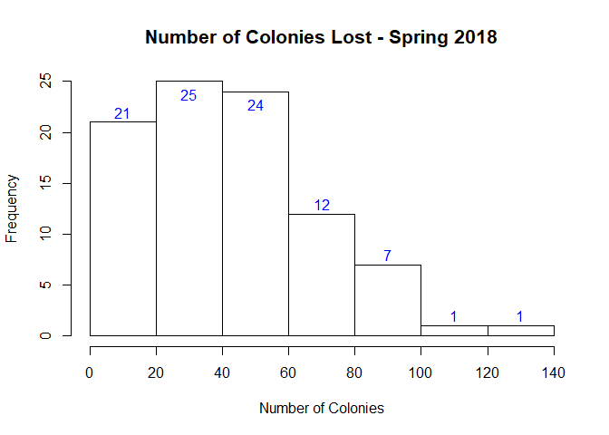<!-- -->

```
## [1] "Number of Non-Missing Data Items"
## [1] 91
## [1] "Mean"
## [1] 45.71429
## [1] "Quartiles"
##    0%   25%   50%   75%  100% 
##   0.0  27.5  40.0  60.0 140.0
```
### Causes of Lost Colonies

```r
x$Cause_V <- sapply(x$Cause_V,function(x){if(is.na(x)){res<-0}else{res<-x}})
x$Cause_D <- sapply(x$Cause_D,function(x){if(is.na(x)){res<-0}else{res<-x}})
x$Cause_ExW <- sapply(x$Cause_ExW,function(x){if(is.na(x)){res<-0}else{res<-x}})
x$Cause_QP <- sapply(x$Cause_QP,function(x){if(is.na(x)){res<-0}else{res<-x}})
x$Cause_St <- sapply(x$Cause_St,function(x){if(is.na(x)){res<-0}else{res<-x}})
x$Cause_Oth <- sapply(x$Cause_Oth,function(x){if(is.na(x)){res<-0}else{res<-x}})
sum(x$Cause_V[!is.na(x$Cause_V)])
```

```
## [1] 82
```

```r
sum(x$Cause_D[!is.na(x$Cause_D)])
```

```
## [1] 47
```

```r
sum(x$Cause_ExW[!is.na(x$Cause_ExW)])
```

```
## [1] 35
```

```r
sum(x$Cause_QP[!is.na(x$Cause_QP)])
```

```
## [1] 12
```

```r
sum(x$Cause_St[!is.na(x$Cause_St)])
```

```
## [1] 18
```

```r
sum(x$Cause_Oth[!is.na(x$Cause_Oth)])
```

```
## [1] 0
```

```r
table(x$Cause_V,x$Cause_D)
```

```
##    
##      0  1
##   0 23  4
##   1 39 43
```

```r
table(x$Cause_V,x$Cause_ExW)
```

```
##    
##      0  1
##   0 22  5
##   1 52 30
```

```r
table(x$Cause_V,x$Cause_QP)
```

```
##    
##      0  1
##   0 27  0
##   1 70 12
```

```r
table(x$Cause_V,x$Cause_St)
```

```
##    
##      0  1
##   0 25  2
##   1 66 16
```

```r
table(x$Cause_D,x$Cause_ExW)
```

```
##    
##      0  1
##   0 37 25
##   1 37 10
```

```r
table(x$Cause_D,x$Cause_QP)
```

```
##    
##      0  1
##   0 56  6
##   1 41  6
```

```r
table(x$Cause_D,x$Cause_St)
```

```
##    
##      0  1
##   0 50 12
##   1 41  6
```

```r
table(x$Cause_ExW,x$Cause_QP)
```

```
##    
##      0  1
##   0 63 11
##   1 34  1
```

```r
table(x$Cause_ExW,x$Cause_St)
```

```
##    
##      0  1
##   0 60 14
##   1 31  4
```

```r
table(x$Cause_QP,x$Cause_St)
```

```
##    
##      0  1
##   0 80 17
##   1 11  1
```
### Did you migrate any of your colonies at least once for honey production or pollination or other reasons in 2017?

```r
factorVariableHistogram(x$Migrate,c("Yes","No"),0.75,1.33,0.04,"Did you migrate any of your colonies at least once\nfor honey production or pollination or other reasons in 2017?")
```

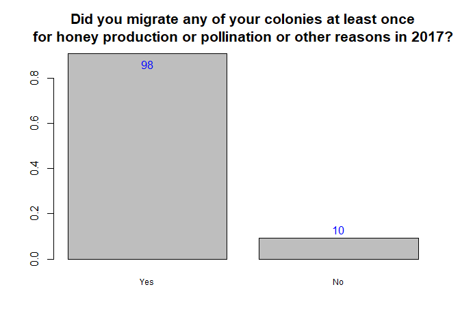<!-- -->

```
## [1] "Number of Non-Missing Data Items"
## [1] 109
## [1] "Histogram Categories and Frequencies"
```

```
## x
##  1  2 
## 98 10
```
### Total Honey Production

```r
quantitativeVariableHistogram(x$Honey_kg,"Kilograms",0.75,1.33,0.04,"Honey Production")
```

<!-- -->

```
## [1] "Number of Non-Missing Data Items"
## [1] 108
## [1] "Mean"
## [1] 889.3519
## [1] "Quartiles"
##   0%  25%  50%  75% 100% 
##  200  575  800  950 5000
```
### Approximately what proportion of brood combs did you replace with comb foundation per colony in 2017?

```r
factorVariableHistogram(x$Broodcomb_rep,c("0%","1-30%","31-50%"),0.75,1.33,0.04,"Approximately what proportion of brood combs\ndid you replace with comb foundation per colony in 2017?")
```

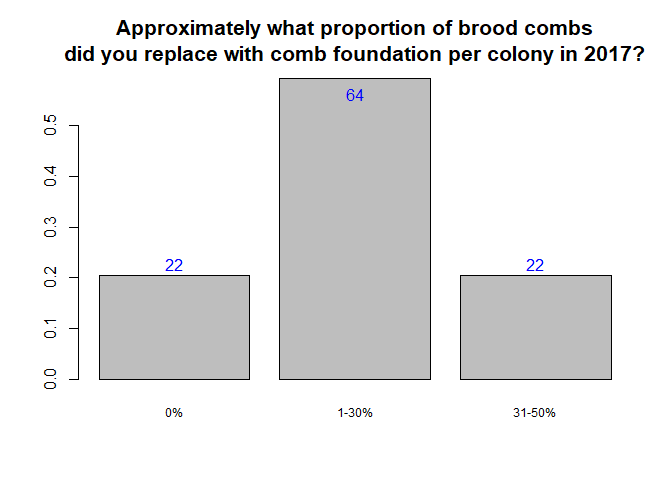<!-- -->

```
## [1] "Number of Non-Missing Data Items"
## [1] 109
## [1] "Histogram Categories and Frequencies"
```

```
## x
##  1  2  3 
## 22 64 22
```
### Do you keep your bees in an area where Varroa has still not been detected?

```r
factorVariableHistogram(x$Varroa_not_det,c("Yes","No","Don't Know"),0.75,1.33,0.04,"Do you keep your bees in an area\nwhere Varroa has still not been detected?")
```

<!-- -->

```
## [1] "Number of Non-Missing Data Items"
## [1] 109
## [1] "Histogram Categories and Frequencies"
```

```
## x
##  1  2  3 
## 74 13 21
```
### Have you monitored your colonies for Varroa during the period April 2017-April 2018?

```r
factorVariableHistogram(x$Varroa_monitor,c("Yes","No","Don't Know / Not Applicable"),0.75,1.33,0.04,"Have you monitored your colonies for Varroa\nduring the period April 2017-April 2018?")
```

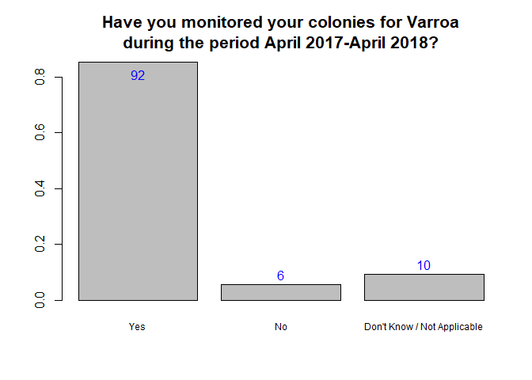<!-- -->

```
## [1] "Number of Non-Missing Data Items"
## [1] 109
## [1] "Histogram Categories and Frequencies"
```

```
## x
##  1  2  3 
## 92  6 10
```
### Have you treated your colonies against Varroa during the period April 2017-April 2018?

```r
factorVariableHistogram(x$Varroa_treated,c("Yes","No","Don't Know / Not Applicable"),0.75,1.33,0.04,"Have you treated your colonies against Varroa\nduring the period April 2017-April 2018?")
```

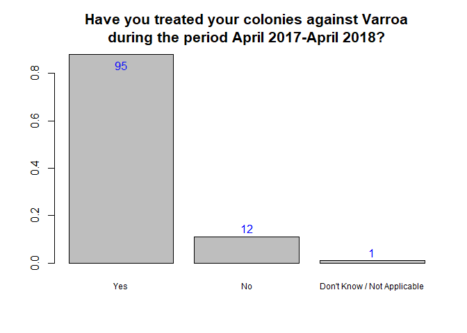<!-- -->

```
## [1] "Number of Non-Missing Data Items"
## [1] 109
## [1] "Histogram Categories and Frequencies"
```

```
## x
##  1  2  3 
## 95 12  1
```
### Question 21

```r
monthValue <- numeric(0)
monthValue <- c(monthValue,sum(x$V_monitor_start_Apr17[!is.na(x$V_monitor_start_Apr17)]))
monthValue <- c(monthValue,sum(x$V_monitor_start_May17[!is.na(x$V_monitor_start_May17)]))
monthValue <- c(monthValue,sum(x$V_monitor_start_Jun17[!is.na(x$V_monitor_start_Jun17)]))
monthValue <- c(monthValue,sum(x$V_monitor_start_Jul17[!is.na(x$V_monitor_start_Jul17)]))
monthValue <- c(monthValue,sum(x$V_monitor_start_Aug17[!is.na(x$V_monitor_start_Aug17)]))
monthValue <- c(monthValue,sum(x$V_monitor_start_Sep.17[!is.na(x$V_monitor_start_Sep.17)]))
monthValue <- c(monthValue,sum(x$V_monitor_start_Oct17[!is.na(x$V_monitor_start_Oct17)]))
monthValue <- c(monthValue,sum(x$V_monitor_start_Nov17[!is.na(x$V_monitor_start_Nov17)]))
monthValue <- c(monthValue,sum(x$V_monitor_start_Dec17[!is.na(x$V_monitor_start_Dec17)]))
monthValue <- c(monthValue,sum(x$V_monitor_start_Jan18[!is.na(x$V_monitor_start_Jan18)]))
monthValue <- c(monthValue,sum(x$V_monitor_start_Feb18[!is.na(x$V_monitor_start_Feb18)]))
monthValue <- c(monthValue,sum(x$V_monitor_start_Mar18[!is.na(x$V_monitor_start_Mar18)]))
monthValue <- c(monthValue,sum(x$V_monitor_start_Apr18[!is.na(x$V_monitor_start_Apr18)]))
monthValueMx <- max(monthValue)
tauValue <- numeric(0)
tauValue <- c(tauValue,sum(x$Tau.fl_Apr17[!is.na(x$Tau.fl_Apr17)]))
tauValue <- c(tauValue,sum(x$Tau.fl_May17[!is.na(x$Tau.fl_May17)]))
tauValue <- c(tauValue,sum(x$Tau.fl_Jun17[!is.na(x$Tau.fl_Jun17)]))
tauValue <- c(tauValue,sum(x$Tau.fl_Jul17[!is.na(x$Tau.fl_Jul17)]))
tauValue <- c(tauValue,sum(x$Tau.fl_Aug17[!is.na(x$Tau.fl_Aug17)]))
tauValue <- c(tauValue,sum(x$Tau.fl_Sep.17[!is.na(x$Tau.fl_Sep.17)]))
tauValue <- c(tauValue,sum(x$Tau.fl__Oct17[!is.na(x$Tau.fl__Oct17)]))
tauValue <- c(tauValue,sum(x$Tau.fl__Nov17[!is.na(x$Tau.fl__Nov17)]))
tauValue <- c(tauValue,sum(x$Tau.fl_Dec17[!is.na(x$Tau.fl_Dec17)]))
tauValue <- c(tauValue,sum(x$Tau.fl__Jan18[!is.na(x$Tau.fl__Jan18)]))
tauValue <- c(tauValue,sum(x$Tau.fl__Feb18[!is.na(x$Tau.fl__Feb18)]))
tauValue <- c(tauValue,sum(x$Tau.fl__Mar18[!is.na(x$Tau.fl__Mar18)]))
tauValue <- c(tauValue,sum(x$Tau.fl_Apr18[!is.na(x$Tau.fl_Apr18)]))
tauValueMx <- max(tauValue)
offset <- 0.05
months <- c("Apr17","May17","Jun17","Jul17","Aug17","Spt17","Oct17","Nov17","Dec17","Jan18","Feb18","Mar18","Apr18")
plt <- barplot(monthValue,names.arg=months,cex.names=0.6)
monthValue2 <- monthValue + offset*monthValueMx
for (i in seq(1,length(monthValue2))) { if(monthValue2[i]>0.95*monthValueMx) { monthValue2[i]<-0.95*(monthValue2[i]-offset*monthValueMx) } }
text(plt,monthValue2,monthValue,col="blue")
```

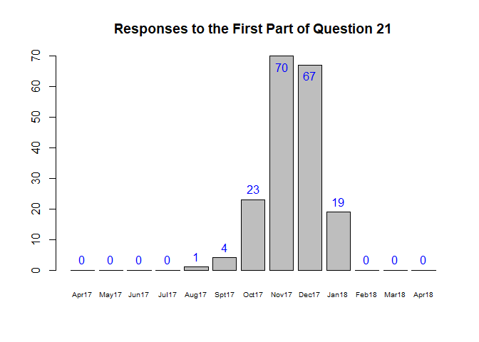<!-- -->

```r
plt <- barplot(tauValue,names.arg=months,cex.names=0.6)
tauValue2 <- tauValue + offset*tauValueMx
for (i in seq(1,length(tauValue2))) { if(tauValue2[i]>0.95*tauValueMx) { tauValue2[i]<-0.95*(tauValue2[i]-offset*tauValueMx) } }
text(plt,tauValue2,tauValue,col="blue")
```

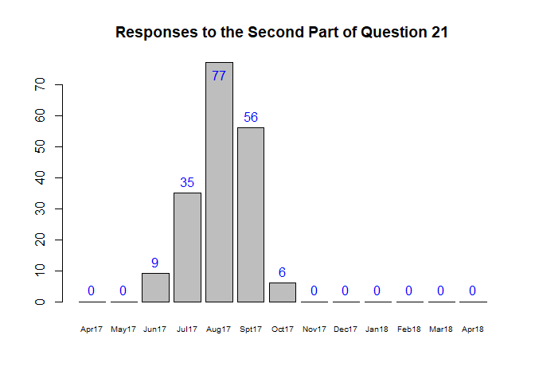<!-- -->

### Have you noticed bees with crippled/deformed wings in your colonies?

```r
factorVariableHistogram(x$Def_wings,c("Not at all","To a limited extent","To a large extent"),0.75,1,0.04,"Have you noticed bees with crippled/deformed wings in your colonies?")
```

<!-- -->

```
## [1] "Number of Non-Missing Data Items"
## [1] 109
## [1] "Histogram Categories and Frequencies"
```

```
## x
##  1  2  3 
## 28 78  3
```
### Which of the following measures apply for the majority of your beekeeping - Screened bottom board

```r
factorVariableHistogram(x$Screened_bottom_brd,c("Yes","No","Don't know"),0.75,1,0.04,"Which of the following measures apply for the majority of your beekeeping?\n - Screened bottom board")
```

<!-- -->

```
## [1] "Number of Non-Missing Data Items"
## [1] 109
## [1] "Histogram Categories and Frequencies"
```

```
## x
##  1  2  3 
## 45 62  1
```
### Which of the following measures apply for the majority of your beekeeping - Insulated Hives

```r
factorVariableHistogram(x$Ins_hives,c("Yes","No","Don't know"),0.75,1,0.04,"Which of the following measures apply for the majority of your beekeeping?\n - Insulated Hives")
```

<!-- -->

```
## [1] "Number of Non-Missing Data Items"
## [1] 109
## [1] "Histogram Categories and Frequencies"
```

```
## x
##  1  2  3 
## 20 80  5
```
### Which of the following measures apply for the majority of your beekeeping - Plastic Hives

```r
factorVariableHistogram(x$Plastic_hives,c("Yes","No","Don't know"),0.75,1,0.04,"Which of the following measures apply for the majority of your beekeeping?\n - Plastic Hives")
```

<!-- -->

```
## [1] "Number of Non-Missing Data Items"
## [1] 109
## [1] "Histogram Categories and Frequencies"
```

```
## x
##  1  2  3 
## 13 87  5
```
### Which of the following measures apply for the majority of your beekeeping - Certified Organic Beekeeping

```r
factorVariableHistogram(x$Cert_organic_beek,c("Yes","No","Don't know"),0.75,1,0.04,"Which of the following measures apply for the majority of your beekeeping?\n - Certified Organic Beekeeping")
```

<!-- -->

```
## [1] "Number of Non-Missing Data Items"
## [1] 109
## [1] "Histogram Categories and Frequencies"
```

```
## x
##  1  2  3 
## 61 42  1
```
### Which of the following measures apply for the majority of your beekeeping - Varroa Tolerant Stock

```r
factorVariableHistogram(x$Varroa_tol_stock,c("Yes","No","Don't know"),0.75,1,0.04,"Which of the following measures apply for the majority of your beekeeping?\n - Varroa Tolerant Stock")
```

<!-- -->

```
## [1] "Number of Non-Missing Data Items"
## [1] 109
## [1] "Histogram Categories and Frequencies"
```

```
## x
##  1  2  3 
## 46 54  6
```
### Which of the following measures apply for the majority of your beekeeping - Small Brood Cell Size (5.1 mm or less)

```r
factorVariableHistogram(x$Small_brood_cell_size,c("Yes","No","Don't know"),0.75,1,0.04,"Which of the following measures apply for the majority of your beekeeping?\n - Small Brood Cell Size (5.1 mm or less)")
```

<!-- -->

```
## [1] "Number of Non-Missing Data Items"
## [1] 109
## [1] "Histogram Categories and Frequencies"
```

```
## x
##  1  2  3 
## 14 80 11
```
### Which of the following measures apply for the majority of your beekeeping - Natural Comb (Without Foundation)

```r
factorVariableHistogram(x$Nat_comb,c("Yes","No","Don't know"),0.75,1,0.04,"Which of the following measures apply for the majority of your beekeeping?\n - Natural Comb (Without Foundation)")
```

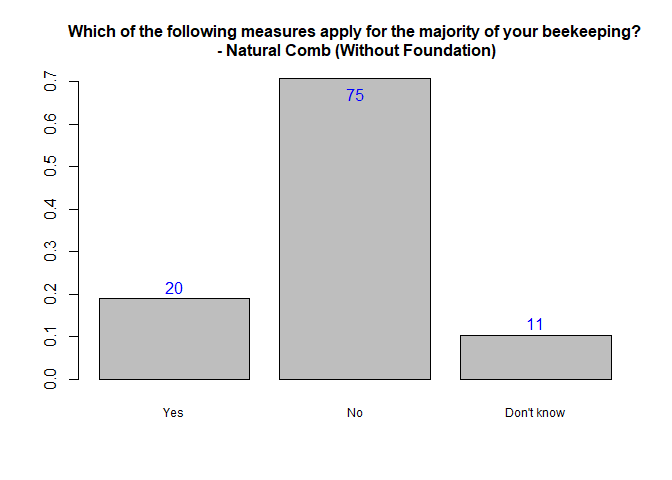<!-- -->

```
## [1] "Number of Non-Missing Data Items"
## [1] 109
## [1] "Histogram Categories and Frequencies"
```

```
## x
##  1  2  3 
## 20 75 11
```
### Which of the following measures apply for the majority of your beekeeping - Purchase Wax from Outside Own Operation

```r
factorVariableHistogram(x$Purchase_wax,c("Yes","No","Don't know"),0.75,1,0.04,"Which of the following measures apply for the majority of your beekeeping?\n - Purchase Wax from Outside Own Operation")
```

<!-- -->

```
## [1] "Number of Non-Missing Data Items"
## [1] 109
## [1] "Histogram Categories and Frequencies"
```

```
## x
##  1  2  3 
## 61 40  4
```
### Are there pests which are a threat to the honey bees in your apiary/apiaries?

```r
factorVariableHistogram(x$Pests,c("Yes","No","Don't know"),0.75,1,0.04,"Are there pests which are a threat to the honey bees in your apiary/apiaries?")
```

<!-- -->

```
## [1] "Number of Non-Missing Data Items"
## [1] 109
## [1] "Histogram Categories and Frequencies"
```

```
## x
##  1  2  3 
## 85 18  5
```
### Are there pests which are a threat to the honey bees in your apiary/apiaries?

```r
pestnames <- levels(x$Pests_name1)[x$Pests_name1]
for (i in seq(1,length(pestnames))) { 
  pestnames[i] <- tolower(pestnames[i]) 
  if (substring(pestnames[i],1,6)=="varroa") { pestnames[i]="varroa" }
}
pestnames2 <- pestnames[pestnames>" "]
pestnames <- as.factor(pestnames)
pestnames2 <- as.factor(pestnames2)
factorVariableHistogram(pestnames2,c("bee wolf","hornet","varroa"),0.75,1,0.04,"What pests are a threat to the honey bees in your apiary/apiaries?")
```

<!-- -->

```
## [1] "Number of Non-Missing Data Items"
## [1] 84
## [1] "Histogram Categories and Frequencies"
```

```
## x
## bee wolf   hornet   varroa 
##       51        2       31
```
### Do you protect your colonies from the weather?

```r
factorVariableHistogram(x$Protect_weather,c("Yes","No"),0.75,1,0.04,"Do you protect your colonies from the weather?")
```

<!-- -->

```
## [1] "Number of Non-Missing Data Items"
## [1] 109
## [1] "Histogram Categories and Frequencies"
```

```
## x
##  1  2 
## 95 13
```
### What strain/race of bees do you mostly keep in your apiary/apiaries?

```r
factorVariableHistogram(x$Bee_race[!is.na(x$Bee_race)],c("Local hybrid of no specific race","Yemeni honey bee","Italian honey bee"),0.75,1,0.04,"What strain/race of bees do you mostly keep in your apiary/apiaries?")
```

<!-- -->

```
## [1] "Number of Non-Missing Data Items"
## [1] 108
## [1] "Histogram Categories and Frequencies"
```

```
## x
##  1  2  4 
## 79 28  1
```
### Do you replace queens?

```r
factorVariableHistogram(x$Replace_queens,c("Yes","No"),0.75,1,0.04,"Do you replace queens?")
```

<!-- -->

```
## [1] "Number of Non-Missing Data Items"
## [1] 109
## [1] "Histogram Categories and Frequencies"
```

```
## x
##  1  2 
## 91 16
```
### In which case do you replace queens?

```r
rqLoss <- x$Rep_queen_loss[!is.na(x$Rep_queen_loss)]
rqYearly <- x$Rep_queen_yearly[!is.na(x$Rep_queen_yearly)]
rqEggs <- x$Rep_queen_eggs[!is.na(x$Rep_queen_eggs)]
rqOther <- x$Rep_queen_other[!is.na(x$Rep_queen_other)]
y <- c(sum(rqLoss),sum(rqYearly),sum(rqEggs))
maxy <- sum(y)
lblx <- c("Loss of Queen Only","Replaced Yearly","Poor Egg Laying")
plt <- barplot(y,names.arg=lblx,main="In which case do you replace queens?")
text(plt,y-maxy*0.02,y,col="blue")
```

<!-- -->

### Do you feel that you have any needs for training or support in your beekeeping?

```r
factorVariableHistogram(x$Training_need,c("No"),0.75,1,0.04,"Do you feel that you have any needs for training or support in your beekeeping?")
```

<!-- -->

```
## [1] "Number of Non-Missing Data Items"
## [1] 109
## [1] "Histogram Categories and Frequencies"
```

```
## x
##   2 
## 109
```


