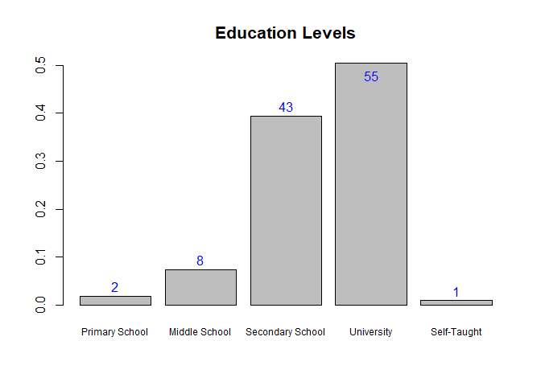
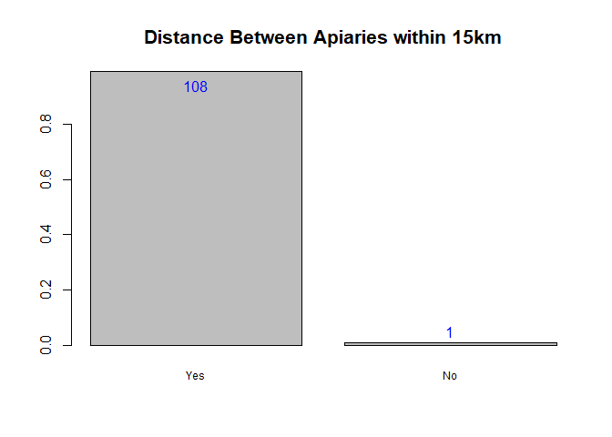
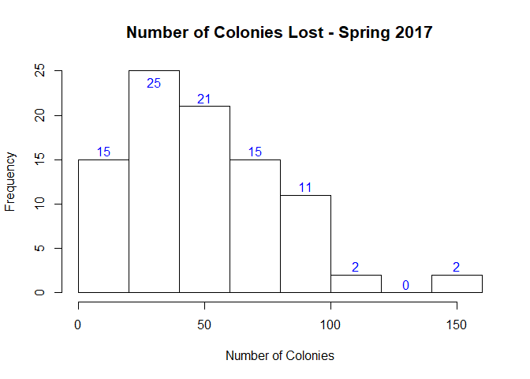

## The Data


```r
x <- read.csv("C:\\Users\\Owner\\Dropbox\\FRDA\\U_20190310_Abdul\\Git01\\survey_data_format.csv",header=TRUE)
```

## Descriptive Analyses


```
## 'data.frame':	109 obs. of  106 variables:
##  $ ï..Beek_ID            : int  1 2 3 4 5 6 7 8 9 10 ...
##  $ Date                  : Factor w/ 95 levels "01-Aug","01-Jul",..: 27 30 34 37 39 39 43 46 49 52 ...
##  $ First_name            : Factor w/ 56 levels "Abdilkhaled",..: 26 26 13 38 48 55 47 15 31 45 ...
##  $ Last_name             : Factor w/ 76 levels "Abdulallh","Abrham",..: 40 62 46 64 43 29 44 26 45 38 ...
##  $ Typ_survey            : Factor w/ 2 levels "hard copy","oniline ": 1 1 1 1 1 1 1 1 1 1 ...
##  $ Address               : logi  NA NA NA NA NA NA ...
##  $ City                  : Factor w/ 7 levels "Abha","Albaha",..: 4 4 4 4 4 4 4 4 4 4 ...
##  $ Post_code             : logi  NA NA NA NA NA NA ...
##  $ Email                 : logi  NA NA NA NA NA NA ...
##  $ Phone                 : int  504535312 563321333 504987374 557888666 505324394 563276868 555502114 552517145 554518622 558493077 ...
##  $ Education             : int  3 3 4 4 4 4 4 3 3 3 ...
##  $ Profession            : Factor w/ 8 levels "beekeeper","business man",..: 4 1 1 8 1 1 4 1 4 5 ...
##  $ Beek_type             : int  1 2 1 1 1 2 2 1 2 2 ...
##  $ Beek_years            : int  15 19 9 19 15 30 31 12 35 13 ...
##  $ Beek_influence        : Factor w/ 5 levels "business","business ",..: 4 5 4 4 4 3 3 4 4 3 ...
##  $ Beek_purpose          : int  1 3 3 1 3 1 1 1 3 1 ...
##  $ Other_purpose         : logi  NA NA NA NA NA NA ...
##  $ Api_city              : Factor w/ 7 levels "Abha","Albaha",..: 4 4 4 4 4 4 4 4 4 4 ...
##  $ Api_postcode          : logi  NA NA NA NA NA NA ...
##  $ Api_region            : Factor w/ 7 levels "Abha","Albaha",..: 4 4 4 4 4 4 4 4 4 4 ...
##  $ Api_no.               : int  1 1 1 1 1 1 1 1 1 1 ...
##  $ Api_15km              : int  1 1 1 1 1 1 1 1 1 1 ...
##  $ Api_env               : int  1 1 1 1 1 1 1 1 1 1 ...
##  $ Other_env             : logi  NA NA NA NA NA NA ...
##  $ Api_loc_type          : int  2 2 2 1 1 2 2 2 1 2 ...
##  $ Other_loc_type        : logi  NA NA NA NA NA NA ...
##  $ Cols__Spr17           : int  350 180 400 560 450 400 380 450 155 200 ...
##  $ Cols_Sum17            : int  300 160 300 490 385 350 360 530 150 180 ...
##  $ Cols_Aut17            : int  320 150 350 440 370 350 360 400 149 170 ...
##  $ Cols_Win1718          : int  310 150 360 430 380 NA 300 390 140 160 ...
##  $ Cols_Spr18            : int  300 180 340 600 390 600 320 470 135 160 ...
##  $ Lost_cols1718         : int  1 1 1 1 1 1 1 2 1 1 ...
##  $ Lost_Spr17            : int  30 20 25 30 50 45 40 NA 10 10 ...
##  $ Lost_Sum17            : int  50 40 45 70 85 65 60 NA 30 20 ...
##  $ Lost_Aut17            : int  35 30 30 50 55 40 20 NA 20 10 ...
##  $ Lost_Win1718          : int  40 10 30 40 55 45 30 NA 10 20 ...
##  $ Lost_Spr18            : int  40 15 30 55 50 50 20 NA 10 15 ...
##  $ Cause_V               : int  1 1 NA NA NA 1 1 NA 1 NA ...
##  $ Cause_D               : int  1 1 NA NA NA NA 1 NA 1 NA ...
##  $ Cause_QP              : int  NA 1 NA NA NA NA NA NA NA NA ...
##  $ Cause_St              : int  NA NA NA 1 NA NA NA NA NA 1 ...
##  $ Cause_ExW             : int  NA NA NA 1 1 1 1 NA NA 1 ...
##  $ Cause_Oth             : logi  NA NA NA NA NA NA ...
##  $ Other_loss_cause      : logi  NA NA NA NA NA NA ...
##  $ Migrate               : int  1 2 2 1 1 1 1 2 2 1 ...
##  $ Migrate_when          : Factor w/ 5 levels ""," May","Apr",..: 3 1 1 2 2 3 3 1 1 3 ...
##  $ Migrate_where         : logi  NA NA NA NA NA NA ...
##  $ Honey_kg              : int  400 390 450 560 360 580 800 660 350 200 ...
##  $ Broodcomb_rep         : int  2 1 1 2 2 1 2 1 1 3 ...
##  $ Varroa_not_det        : int  1 3 3 3 1 3 2 1 2 2 ...
##  $ Varroa_monitor        : int  1 3 3 1 1 3 1 2 1 3 ...
##  $ Varroa_treated        : int  1 1 1 2 2 1 1 2 1 1 ...
##  $ V_monitor_start_Apr17 : logi  NA NA NA NA NA NA ...
##  $ V_monitor_start_May17 : logi  NA NA NA NA NA NA ...
##  $ V_monitor_start_Jun17 : logi  NA NA NA NA NA NA ...
##  $ V_monitor_start_Jul17 : logi  NA NA NA NA NA NA ...
##  $ V_monitor_start_Aug17 : int  NA NA NA NA NA NA NA NA NA NA ...
##  $ V_monitor_start_Sep.17: int  NA NA NA NA NA NA NA NA NA NA ...
##  $ V_monitor_start_Oct17 : int  NA NA 1 NA NA NA 1 NA NA NA ...
##  $ V_monitor_start_Nov17 : int  1 1 1 NA NA NA 1 NA 1 1 ...
##  $ V_monitor_start_Dec17 : int  1 NA NA NA NA NA NA NA 1 1 ...
##  $ V_monitor_start_Jan18 : int  NA NA NA NA NA NA NA NA NA NA ...
##  $ V_monitor_start_Feb18 : logi  NA NA NA NA NA NA ...
##  $ V_monitor_start_Mar18 : logi  NA NA NA NA NA NA ...
##  $ V_monitor_start_Apr18 : logi  NA NA NA NA NA NA ...
##  $ Tau.fl_Apr17          : logi  NA NA NA NA NA NA ...
##  $ Tau.fl_May17          : logi  NA NA NA NA NA NA ...
##  $ Tau.fl_Jun17          : int  NA NA NA NA NA NA NA NA NA NA ...
##  $ Tau.fl_Jul17          : int  1 NA NA NA NA NA NA NA NA NA ...
##  $ Tau.fl_Aug17          : int  1 1 1 NA NA 1 NA NA NA 1 ...
##  $ Tau.fl_Sep.17         : int  NA 1 1 NA NA 1 NA NA NA 1 ...
##  $ Tau.fl__Oct17         : int  NA NA NA NA NA NA NA NA NA NA ...
##  $ Tau.fl__Nov17         : logi  NA NA NA NA NA NA ...
##  $ Tau.fl_Dec17          : logi  NA NA NA NA NA NA ...
##  $ Tau.fl__Jan18         : logi  NA NA NA NA NA NA ...
##  $ Tau.fl__Feb18         : logi  NA NA NA NA NA NA ...
##  $ Tau.fl__Mar18         : logi  NA NA NA NA NA NA ...
##  $ Tau.fl_Apr18          : logi  NA NA NA NA NA NA ...
##  $ Def_wings             : int  1 2 2 1 2 2 2 1 2 3 ...
##  $ Screened_bottom_brd   : int  1 1 1 NA 2 1 1 1 1 1 ...
##  $ Ins_hives             : int  NA NA NA NA 2 2 2 2 2 2 ...
##  $ Plastic_hives         : int  NA NA NA NA 2 2 2 2 2 2 ...
##  $ Cert_organic_beek     : int  NA NA NA NA 1 2 2 2 2 2 ...
##  $ Varroa_tol_stock      : int  NA NA NA 1 1 2 2 1 2 1 ...
##  $ Small_brood_cell_size : int  NA NA NA NA 2 2 2 2 2 2 ...
##  $ Nat_comb              : int  NA NA NA 1 2 2 2 2 2 2 ...
##  $ Purchase_wax          : int  NA NA NA NA 1 1 1 1 1 1 ...
##  $ Pests                 : int  1 1 1 1 1 1 1 3 3 3 ...
##  $ Pests_name1           : Factor w/ 6 levels "","bee wolf",..: 2 3 4 3 6 4 2 1 1 1 ...
##  $ Pests_name2           : logi  NA NA NA NA NA NA ...
##  $ Pests_name3           : logi  NA NA NA NA NA NA ...
##  $ Protect_weather       : int  1 1 1 1 1 1 1 1 2 1 ...
##  $ Protect_weather1      : Factor w/ 3 levels "","shaded","Shaded": 3 3 3 3 2 3 3 3 1 3 ...
##  $ Protect_weather2      : logi  NA NA NA NA NA NA ...
##  $ Protect_weather3      : logi  NA NA NA NA NA NA ...
##  $ Bee_race              : int  2 2 2 1 1 2 2 1 1 2 ...
##  $ Other_bee_race        : logi  NA NA NA NA NA NA ...
##  $ Replace_queens        : int  1 2 1 1 1 2 1 2 2 2 ...
##  $ Rep_queen_loss        : int  NA NA NA NA 1 NA NA NA NA NA ...
##   [list output truncated]
```
### Education Levels

```r
factorVariableHistogram(x$Education,c("Primary School","Middle School","Secondary School","University","Self-Taught"),0.75,"Education Levels")
```

<!-- -->

```
## [1] "Number of Non-Missing Data Items"
## [1] 109
## [1] "Histogram Categories and Frequencies"
```

```
## x
##  1  2  3  4  5 
##  2  8 43 55  1
```
### Type of Beekeeper

```r
factorVariableHistogram(x$Beek_type,c("Hobby","Semi-Professional","Professional","Other"),0.75,"Type of Beekeper")
```

<!-- -->

```
## [1] "Number of Non-Missing Data Items"
## [1] 109
## [1] "Histogram Categories and Frequencies"
```

```
## x
##  1  2  3  4 
## 48 37 23  1
```
### Beekeeper Experience

```r
quantitativeVariableHistogram(x$Beek_years,"Years",0.75,"Beekeeper Experience")
```

<!-- -->

```
## [1] "Number of Non-Missing Data Items"
## [1] 109
## [1] "Mean"
## [1] 20.75229
## [1] "Quartiles"
##   0%  25%  50%  75% 100% 
##    2   14   20   27   45
```
### Beekeeping Purpose

```r
factorVariableHistogram(x$Beek_purpose,c("To Produce Honey","Breed and Sell Bees","Both of the Above"),0.75,"Beekeeping Purpose")
```

<!-- -->

```
## [1] "Number of Non-Missing Data Items"
## [1] 109
## [1] "Histogram Categories and Frequencies"
```

```
## x
##  1  2  3 
## 54  1 54
```
### Apiary Distance

```r
factorVariableHistogram(x$Api_15km,c("Yes","No"),0.75,"Distance Between Apiaries within 15km")
```

<!-- -->

```
## [1] "Number of Non-Missing Data Items"
## [1] 109
## [1] "Histogram Categories and Frequencies"
```

```
## x
##   1   2 
## 108   1
```
### Main Apiary Environment

```r
factorVariableHistogram(x$Api_env,c("Forest/Woodland","Cultivated Field","Orchard"),0.75,"Main Apiary Environment")
```

<!-- -->

```
## [1] "Number of Non-Missing Data Items"
## [1] 109
## [1] "Histogram Categories and Frequencies"
```

```
## x
##  1  2  3 
## 73 34  1
```
### Immediate Apiary Environment

```r
factorVariableHistogram(x$Api_loc_type,c("Sunny","Shaded","Sheltered/Closed Place"),0.75,"Immediate Apiary Environment")
```

<!-- -->

```
## [1] "Number of Non-Missing Data Items"
## [1] 109
## [1] "Histogram Categories and Frequencies"
```

```
## x
##  1  2  3 
## 38 69  1
```
### Number of Colonies - Spring 2017

```r
quantitativeVariableHistogram(x$Cols__Spr17,"Number of Colonies",0.75,"Number of Colonies - Spring 2017")
```

<!-- -->

```
## [1] "Number of Non-Missing Data Items"
## [1] 109
## [1] "Mean"
## [1] 575.4587
## [1] "Quartiles"
##   0%  25%  50%  75% 100% 
##  155  360  540  710 1600
```
### Number of Colonies - Summer 2017

```r
quantitativeVariableHistogram(x$Cols_Sum17,"Number of Colonies",0.75,"Number of Colonies - Summer 2017")
```

<!-- -->

```
## [1] "Number of Non-Missing Data Items"
## [1] 109
## [1] "Mean"
## [1] 569.9541
## [1] "Quartiles"
##   0%  25%  50%  75% 100% 
##  150  350  500  750 1500
```
### Number of Colonies - Autumn 2017

```r
quantitativeVariableHistogram(x$Cols_Aut17,"Number of Colonies",0.75,"Number of Colonies - Autumn 2017")
```

<!-- -->

```
## [1] "Number of Non-Missing Data Items"
## [1] 109
## [1] "Mean"
## [1] 558.9817
## [1] "Quartiles"
##   0%  25%  50%  75% 100% 
##  149  350  500  700 1300
```
### Number of Colonies - Winter 2017-18

```r
quantitativeVariableHistogram(x$Cols_Win1718,"Number of Colonies",0.75,"Number of Colonies - Winter 2017-18")
```

<!-- -->

```
## [1] "Number of Non-Missing Data Items"
## [1] 108
## [1] "Mean"
## [1] 556.9444
## [1] "Quartiles"
##   0%  25%  50%  75% 100% 
##  140  380  500  700 1300
```
### Number of Colonies - Spring 2018

```r
quantitativeVariableHistogram(x$Cols_Spr18,"Number of Colonies",0.75,"Number of Colonies - Spring 2018")
```

<!-- -->

```
## [1] "Number of Non-Missing Data Items"
## [1] 109
## [1] "Mean"
## [1] 579.4037
## [1] "Quartiles"
##   0%  25%  50%  75% 100% 
##  135  400  540  720 1700
```
### Have you observed any losses of production colonies during the period from 2017 to 2018?

```r
factorVariableHistogram(x$Lost_cols1718,c("Yes","No"),0.75,"Have you observed any losses of production colonies\nduring the period from 2017 to 2018?")
```

<!-- -->

```
## [1] "Number of Non-Missing Data Items"
## [1] 109
## [1] "Histogram Categories and Frequencies"
```

```
## x
##  1  2 
## 91 18
```
### Number of Losses - Spring 2017

```r
quantitativeVariableHistogram(x$Lost_Spr17,"Number of Colonies",0.75,"Number of Colonies Lost - Spring 2017")
```

<!-- -->

```
## [1] "Number of Non-Missing Data Items"
## [1] 91
## [1] "Mean"
## [1] 53.18681
## [1] "Quartiles"
##   0%  25%  50%  75% 100% 
##    0   30   50   70  150
```


